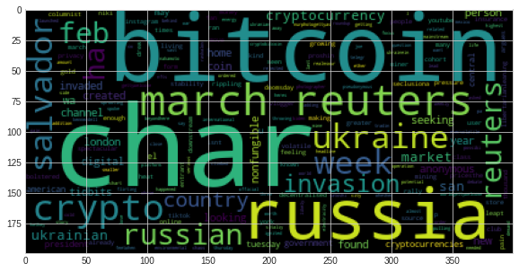
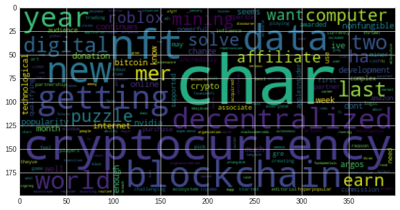

# Tales from the Crypto

This notebook analyses news feed from [newsapi](https://newsapi.org/) to pull the latest news articles for Bitcoin and Ethereum. Processes the news feed using various NLP techniques.

[Starter Notebook](crypto_sentiment.ipynb)

## Crypto Sentiment Analysis

### Questions:

Q: Which coin had the highest mean positive score?

A: Etherium has title_pos mean score of 0.136100 and text_pos mean score of 0.08225

Q: Which coin had the highest compound score?

A: Etherium has title_compound max score of 0.08225 and text_compound max score of 0.826800

Q. Which coin had the highest positive score?

A: Etherium has title_pos score of 0.437000 and text_pos score of 0.25100

## Natural Language Processing

### Word clouds:

word clouds for each coin to summarize the news for each coin.

### Resources

[Vader Sentiment Analysis](http://www.nltk.org/howto/sentiment.html)

